<h1 align="center">
    Estudio sobre el Transporte Público de la Región Metropolitana de Chile
</h1>

## 1. Contexto

El sistema de transporte público Red Metropolitana de Movilidad en Santiago es una red dinámica que debe adaptar su oferta para satisfacer las variaciones extremas de la demanda a lo largo de la semana.

## 2. Motivación

Como estudiantes de ciencia de datos, nos motiva aplicar técnicas de Análisis de Datos para evaluar la equidad y eficiencia del sistema de transporte en función del tiempo y el espacio. Específicamente, buscamos:

 - **Cuantificar la Disparidad Semanal**

 - **Identificar la Vulnerabilidad Geográfica** 

 - **Generar decisiones operacionales**

## 3. ETL

A partir de los datos originales, extraemos los columnas que nos importan que son:

`tipo_transporte`, `tiene_bajada`, `tiempo_subida`, `tiempo_bajada`, `tiempo_etapa`, `comuna_subida`, `comuna_bajada`, `parada_subida`, `parada_bajada`, `dist_ruta_paraderos`, `dist_eucl_paraderos`, `x_subida`,`y_subida`, `x_bajada`, `y_bajada`

Después la limpiamos y transformamos.

Además agregamos unos columnas como:
- `time_range`: si es `early`, `morning`, `afternoon` o `night`
- `time_type`: es una hora de punta o no, si es, es la de mañana o de noche
para facilitar nuestra exploración.

Por otro lado también extraemos datos como la cantidad de pasajeros y tiempo de viaje por horas.

## 4. EDA

En esta sección exploramos las relaciones que pueden tener los datos. 

### 4.1 ¿Cómo varía el tiempo de viaje respecto la hora (hora normal y hora de punta)?

Nos resulta:
    
|         time_type | tiempo_etapa |
|------------------:|--------------|
|            normal |  1167.508742 |
| rush_time-morning |  1340.028490 |
|   rush_time-night |  1344.335397 |

es muy lógica, pues en las hora puntas hay más transporte.

Aún más, podemos especificar el tipo de transporte:

|         time_type | tipo_transporte | tiempo_etapa |
|------------------:|----------------:|-------------:|
|            normal |             BUS |   902.424514 |
|                   |           METRO |  1381.771305 |
| rush_time-morning |             BUS |  1041.310440 |
|                   |           METRO |  1545.280265 |
|   rush_time-night |             BUS |  1222.069767 |
|                   |           METRO |  1454.527629 |

### 4.2 ¿Cómo varia la cantidad de pasajeros respecto el tipo de transporte?

Podemos verificar de donde vienen la mayoría de datos de transporte:

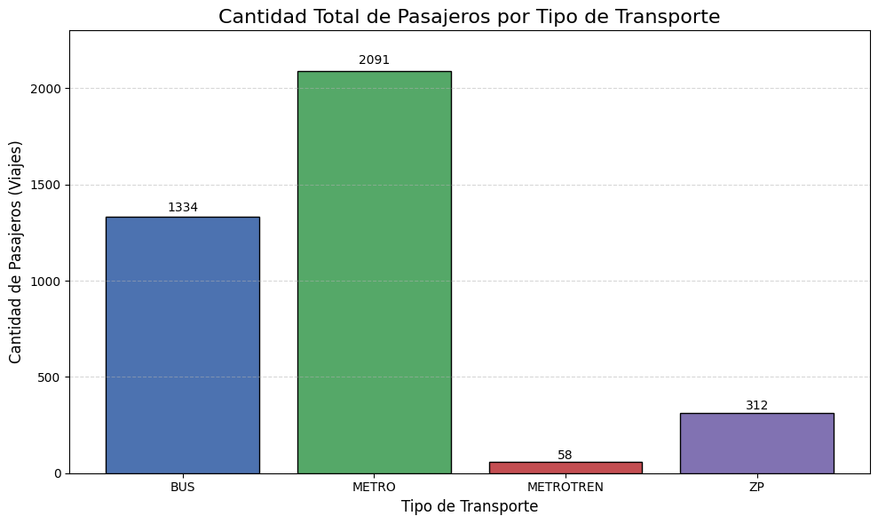

(fig. 4.2-1, Histograma del cantidad de pasajeros segun tipo de transporte)

Claramente podemos ver que la mayoría de nuestros datos provienen de transportes como metro o bus

### 4.3 ¿Cómo varían la comuna subida y comuna bajada respecto la hora?

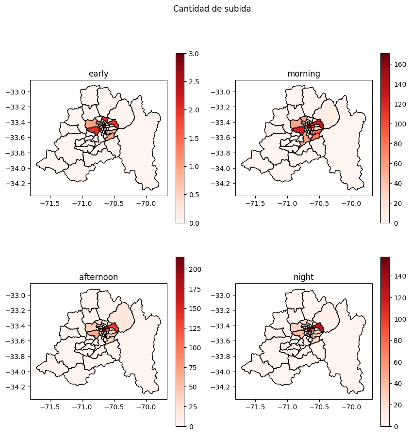

(fig. 4.3-1, Heatmap de la cantidad de subida)

 

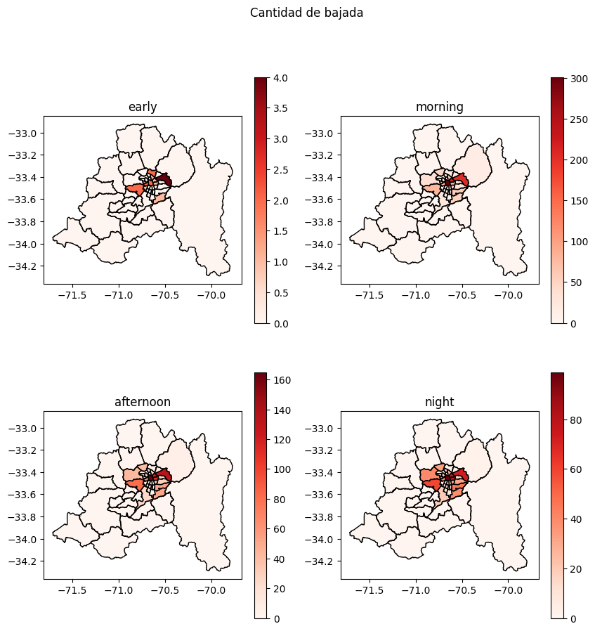

(fig. 4.3-2, Heatmap de la cantidad de bajado)

Estos mapas nos permiten entender cómo se comporta la demanda de transporte público en Santiago a lo largo de un día. Utilizamos la intensidad del color para representar la cantidad de pasajeros.

Como pueden ver, la conclusión es que la demanda tanto la de subida como la de bajada está fuertemente centralizada en todos los rangos horarios.

### 4.4 ¿Cuánto tiempo viaja la mayoría de pasajeros?

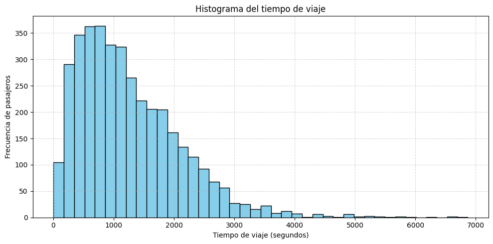

(fig. 4.4-1, Histograma del tiempo de viaje)

A través de este gráfico, nos permite identificar la forma, el pico y el sesgo de la duración de todos los viajes. 

La conclusión es que la distribución está fuertemente sesgada a la izquierda, con un pico de frecuencia muy claro. 

Al observar el pico, se evidencia que la gran mayoría de los viajes dura menos de 1,500 segundos (25 minutos), siendo la duración más común aquella alrededor de los 1,000 segundos (aproximadamente 16-17 minutos), y los viajes de más de 4,000 segundos son muy raros.

Incluso podemos comparar estos mismos tiempos y frecuencia entre cada transporte:

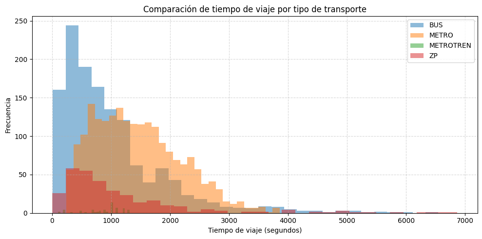

(fig. 4.4-2, Histograma del tiempo de viaje coloreado segun el tipo de transporte)

Podemos observar que la frecuencia alta del BUS en el lado izquierdo (viajes cortos) y la distribución más extendida y larga del METRO hacia la derecha, muestran claramente la función de cada uno: el bus maneja el volumen de viajes cortos y locales, mientras que el metro es esencial para los trayectos más largos.

### 4.5 ¿Cuáles son las horas en que hay más personas?

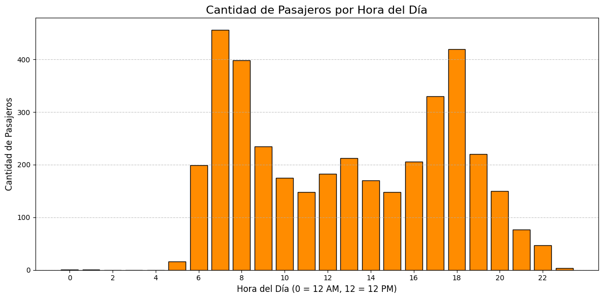

(fig. 4.5-1, Histograma del cantidad de pasajeros segun la hora)

Visualizamos la Cantidad de Pasajeros por Hora del Día en Santiago. 

La conclusión que presenta el gráfico es la clara identificación de los períodos pico o de máxima demanda: se observa un aumento significativo de pasajeros durante la mañana (aproximadamente entre las 7 y 9 AM) y un segundo pico más alto durante la tarde (aproximadamente entre las 5 y 7 PM).

Incluso podemos revisar en qué horarios toman más tiempo los viajes:

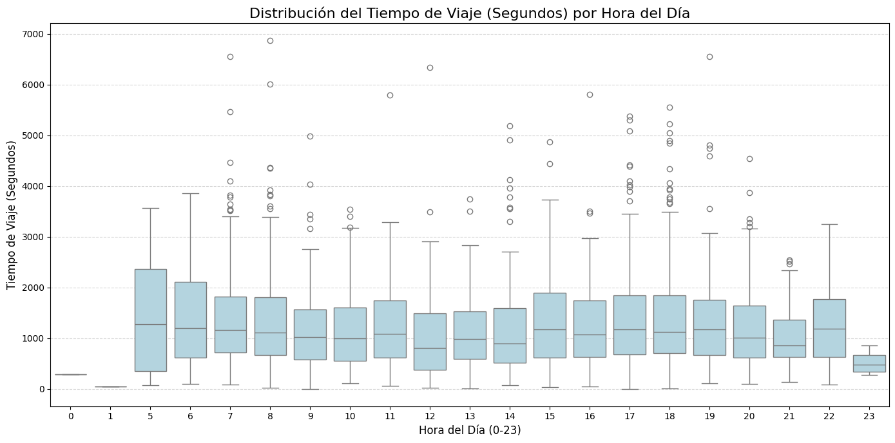

(fig. 4.5-2, Distribucion del tiempo de viaje segun la hora)

A través de este gráfico se ve cómo se incrementa o estabiliza la duración típica del viaje (la mediana) durante las horas pico de la mañana y la tarde, y cuánta incertidumbre hay en el tiempo de viaje, representada por la altura de las cajas.

## 5. Responder las preguntas

### 5.1 Como afecta las condiciones meteorologicas en la cantidad de pasajeros.

En este sección verificar el siguiente hipótesis:

> Las condiciones meteorológicas(la temperatura, la humedad, la calidad de aire) afectan la cantidad de pasajeros.
> Donde la temperatura y la calidad de aire se afectan negativamente, la humedad se afecta positivamente.`   
> (i.e. A mayor temperatura, a mayor el indicador de la calidad de aire o a menos la humedad, menos es la cantidad de pasajeros.)

Para esta pregunta vamos a usar los siguientes datos:
- la cantidad de pasajeros.
- la temperatura aparente, humedad relativa y calidad de aire(mp2.5)

desde `2025-04-21` a `2025-04-27`, y dividida por hora.

#### 5.1.1 Relacion entre los datos

Para tener un intuición sobre estos datos, hicimos unos scatterplot y un heatmap de correlación, los cuales indican las relaciones que pueden tener.

En primer lugar, veamos la tendencia de los puntos.

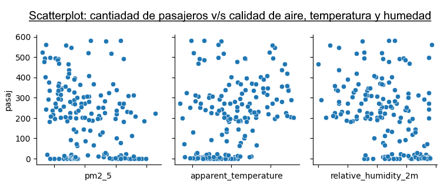
(fig. 5.1.1-1, Scatterplot entre la cantidad de pasajeros y los datos meteorológicos)

Se puede notar que los puntos están dispersos, parece que se puede trazar una recta con pendiente negativa para el gráfico de la calidad de aire y de la humedad, además una recta con pendiente positiva para la temperatura.

Luego veamos las correlaciones

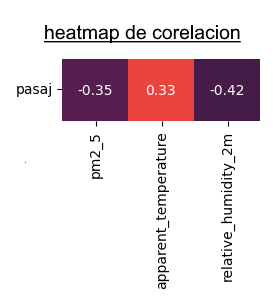
(fig. 5.1.1-2, Heatmap de correlación entre la cantidad de pasajeros y los datos meteorológicos)

Como se ve, todo tiene una correlación menor que 0.5.

#### 5.1.2 Modelo

Para verificar nuestra hipótesis, vamos a entrenar un modelo que recibe la condición meteorológicas y predice la cantidad de pasajeros, luego comparamos el resultado con el dato real, así verificando el eficaz del modelo y nuestra hipótesis pues asumimos que tienen una dependencia entre estos datos.

#####  Resultado

Y resultamos los siguientes métricas:

> Raíz del Error Cuadrático Medio (RMSE) en datos de Test: 143.50
Mean Absolute Error (MAE) en datos de Test: 108.86
Coeficiente R^2 en datos de Test: 0.36

Estos números nos indican que el modelo no es eficaz, es decir capaz de predecir la cantidad de pasajeros.

Vamos a complementar estas métricas con unos gráficos.

En el siguiente gráfico podemos verificar el efecto de cada variable, y concluimos que todas estas variables afectan negativamente a la cantidad de pasajeros.

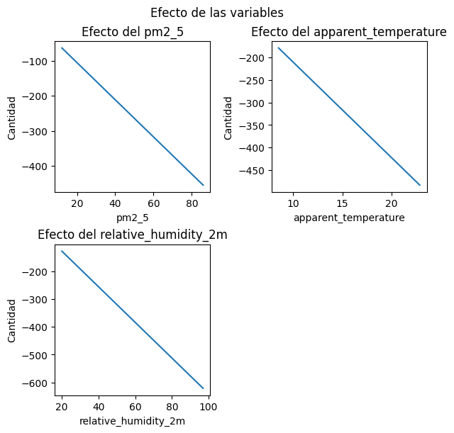

(fig. 5.1.2-1, Rectas que representan el afecto de cada variable)

Y ahora comparamos la variable dependiente real con la predicha, para verificar el eficaz del modelo, queremos que los puntos estén cerca de identidad (y=x).

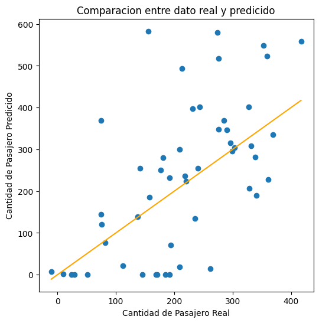

(fig. 5.1.2-2, Grafico que compara la variable dependiente real y la predicha)

Se nota que no todos los puntos están cerca de la identidad, hay muchas excepciones. verifica la conclusión de que el modelo falta eficaz.

#### 5.1.3 Conclusion

En este modelo, la temperatura, la calidad del aire y la humedad afectan la cantidad de pasajeros. Las tres variables lo hacen de forma negativa, sin embargo la humedad, suponemos tiene un efecto positivo.

Además este modelo no es capaz de predecir la cantidad de pasajeros, implicando que la cantidad no tiene una dependencia fuerte con los datos meteorológicos.

En conclusión, no establece nuestra hipótesis.

##### ¿Qué podría salir mal?

1. La muestra que elegimos era muy pequeña en comparación con el dato real, reduciendo la fiabilidad de nuestros resultados.
2. Las variables independientes que elegimos están correlacionadas, puede causar multicolinealidad.

### 5.2 ¿Podemos predecir el tiempo de viaje? 

La predicción de tiempos de viaje en el transporte público no es solo un dato técnico, sino una herramienta clave para mejorar la calidad del servicio y la planificación urbana. Éstas métricas permiten analizar la experiencia de los pasajeros, permite eventualmente beneficios para la operación y la planificación. 

¿Qué Betas tenemos para ello? 
- B1 para "dist_ruta_paraderos" correspondiente a la Distancia de la ruta)
- B2 para dist_eucl_paraderos correspondiente a la Distancia euclidiana entre paraderos
- B3 para cada tipo_transporte ya sea bus , tren o metro que previamente se convierte a one hot enconding
- B4 para cada time_type como Horario Punta vs Valle, tambien convertido a one hot
- B5 para cada comuna_subida , tambien con one hot

Nuestra x era el tiempo etapa, que era el trayecto 

#### 5.2.1 Modelo de Regresión Lineal:

##### Introduccion

- Primero comenzamos modelando la relación entre las variables como si se comportasen linealmente, buscamos un valor que predijera un valor continuo sobre el tiempo entre distintos tramos
- El objetivo fue predecir el tiempo de viaje (tiempo_etapa) basándose en distancia, tipo de transporte y comuna

##### Visualización del modelo Regresión Lineal

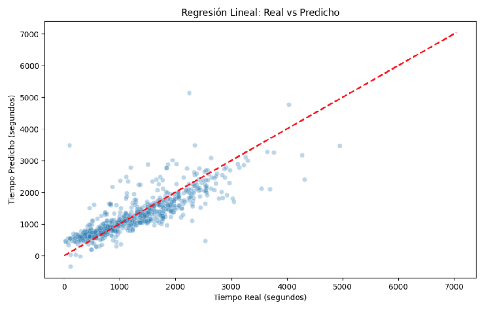

##### Resultado Modelo de Regresión Lineal

- Funcionó como un modelo base (baseline) aceptable, pero superable.
  R²: 0.68 (Explica el 68% de la variabilidad).
  RMSE: 460.14 segundos (aprox. 7.6 minutos de error promedio).
- Sirvió para demostrar que el problema no es puramente lineal.

##### ¿Que podría salir mal?

- La principal dificultad fue determinar si nuestras betas representaban un comportamiento lineal, sin embargo teníamos claro que este modelo era solamente construido como baseline. Por lo que no teniamos muchas expectativas de su rendimiento

#### 5.2.2 Modelo Random Forest:

##### Introduccion
- Se usó para modelar la no-linealidad del tráfico urbano, entendiendo que el contexto (hora, lugar, medio) altera la relación entre distancia y tiempo.

##### Visualización del modelo Random Forest

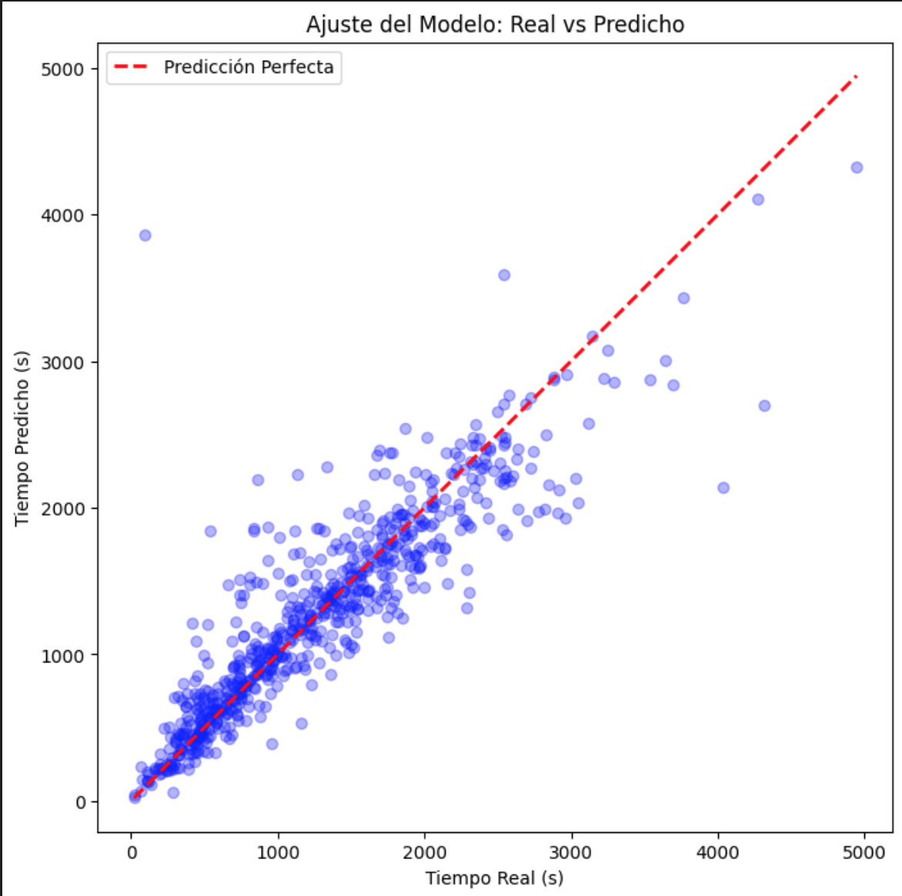

##### Resultado Modelo de Random Forest

- Fue el modelo que demostró que se podía predecir con alta precisión. Pasó de un R² de 0.68 (Regresión Lineal) a un 0.81. Esto confirmó que las variables tenían suficiente información para hacer buenas predicciones si se usaba el algoritmo correcto.

##### ¿Que podría salir mal?

- El modelo Random Forest no puede predecir valores que estén fuera del rango de los datos de entrenamiento.por ejemplo si el modelo nunca vio un viaje que durara 3 horas (por ejemplo, debido a un taco ), nunca predecirá 3 horas. Como máximo, predecirá el valor más alto que vio en el entrenamiento (ej. 2 horas). Este es la mayor debilidad del modelo

#### 5.2.3 Modelo Gradient Bossting:

##### Introduccion
- Mientras que la Regresión Lineal capturó la tendencia general y el Random Forest capturó la estructura no lineal, el Gradient Boosting se utilizó para atacar los errores residuales que los otros modelos no pudieron resolver
- El objetivo fue evaluar otro modelo para lograr un mejor ajuste

##### Visualización del modelo Regresión Lineal

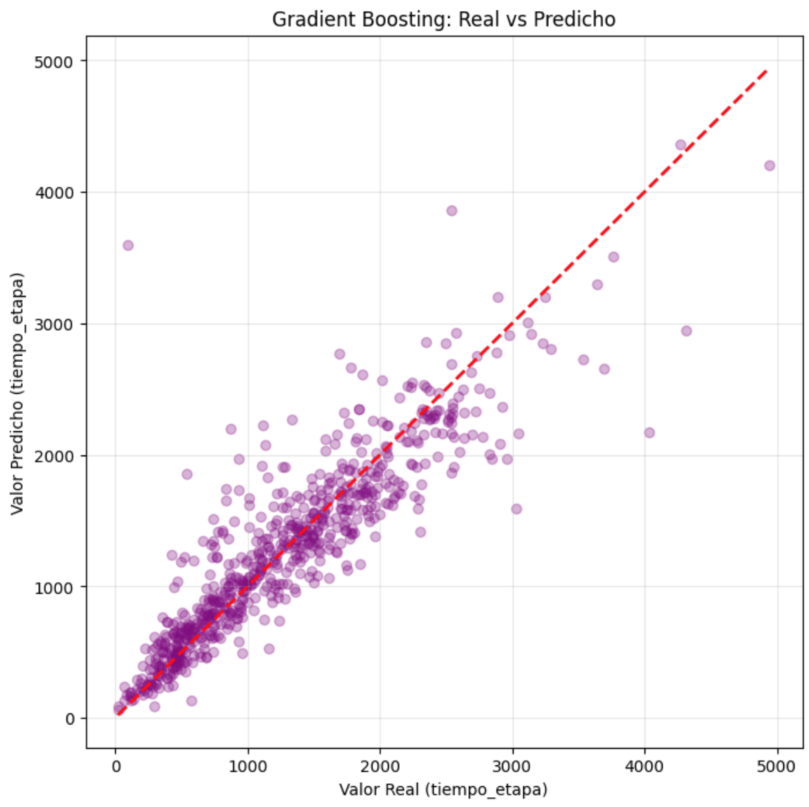

##### Resultado Modelo de Gradient Boosting:

- El experimento con Gradient Boosting demuestra que el sistema mantiene los mismos numeros. Se logró reducir significativamente el error respecto a la línea base (Regresión Lineal), estabilizando las predicciones en un rango de confianza del 80%, lo cual es un estándar alto para sistemas de transporte urbano complejos como el de Santiago

##### ¿Que podría salir mal?

- La principal dificultad es que como el modelo funciona minimizando los residuos ,es decir, la diferencia entre la predicción y la realidad, los errores grandes significan mucho más, es decir que es muy sensible a valores atipicos o otliers

#### 5.2.4 Conclusión: 

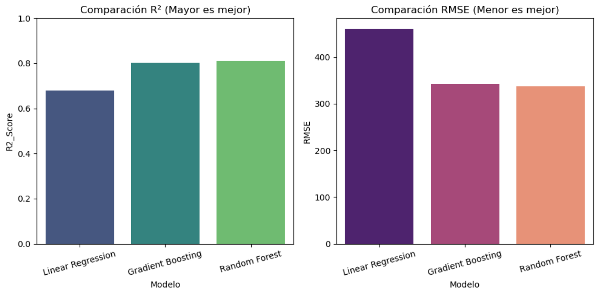

El análisis comparativo evidencia que el problema de predicción de tiempos de viaje es de naturaleza no lineal. La implementación de modelos basados en árboles (Random Forest y Gradient Boosting) superó significativamente a la regresión lineal base, elevando el coeficiente R2 de 0.68 a 0.81 y reduciendo el error promedio (RMSE) en un 26% (122 unidades). Si bien Random Forest presentó el mejor desempeño marginal, el estancamiento de las métricas en torno a 0.81 indica una saturación de la capacidad predictiva de las variables actuales, sugiriendo que para superar este umbral seriá necesario incorporar nuevas fuentes de datos (como horarios o flujo vehicular en tiempo real).

### 5.3 ¿Que impacto tienen los accidentes de trafico en el transporte publico?
La hipotesis de este analisis seran las siguientes:

> El tiempo de viajes en transporte pubico se ve aumentado segun la cantidad de accidentes ese mismo dia.
> Es posible definir rutas de transporte publico más peligrosas y con un modelo de Machine Learning
> predecir que tipo de conductor seria necesario para los paraderos con más riesgo

Para esta pregunta vamos a usar los siguientes datos:
- Cantidad de viajes por paradero.
- Informe de siniestros de trafico de conaset.

#### 5.3.1 Relacion entre los datos
la información se consolido a nivel de paradero de subida (x_subida, y_subida) para calcular el riesgo acumulado para medir viajes vs accidentes.

Agrupamiento Geoespacial: Se agruparon los datos por las coordenadas únicas (x_subida, y_subida).

Métricas Agregadas: Se calculó el conteo_viajes (volumen de tráfico) y la suma total de total_victimas por paradero.

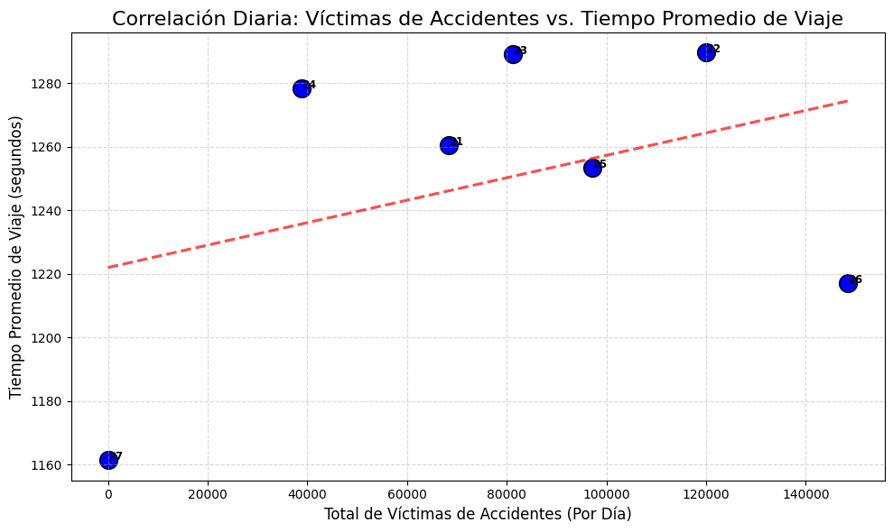

> En nuestro primer analisis podemos ver una pequeña relacion entre el tiempo de viaje y
> la cantidad de victimas de accidentes de trafico (i.e. impacto del siniestro en el flujo normal de transito)

#### 5.3.2 Vamos ahora a preparar los datos para medir las rutas mas riesgosas

Preparación de Variables

Las variables categóricas (tipo_transporte, comuna_subida, time_type) fueron transformadas mediante One-Hot Encoding (pd.get_dummies) para ser procesadas por el algoritmo.

Las variables numéricas (x_subida, y_subida, conteo_viajes) fueron escaladas utilizando StandardScaler. Esto asegura que las coordenadas y el volumen de tráfico contribuyan de manera equitativa a la distancia y las divisiones del árbol, sin que su magnitud distorsione el modelo.

#### 5.3.3 Modelo

Creación de la Variable Objetivo (Y): Nivel_Conductor_Requerido
Se creó una variable categórica de tres niveles (Novato, Intermedio, Experto) basada en los percentiles de la métrica de riesgo (total_victimas agregada por paradero):

> Novato: Riesgo $\leq$ Percentil 70 (Q70)

> Intermedio: Riesgo entre Percentil 70 y Percentil 90

> Experto: Riesgo $\geq$ Percentil 90 (Zonas de riesgo crítico)

**Algoritmo Elegido: Random Forest Classifier.**

La gran utilidad de este modelo radica en su capacidad para prevenir el riesgo antes de que ocurra, respondiendo a la pregunta:

##### "Si un viaje inicia en el paradero X, ¿debe ser asignado a un conductor Novato, Intermedio o Experto?"

Se eligió Random Forest por su alta precisión y su capacidad para manejar la complejidad no lineal de las coordenadas geográficas. Además, este modelo proporciona una métrica de Importancia de Características invaluable para justificar las decisiones de asignación de riesgo.

#### 5.3.4 **Importancia de las Variables**

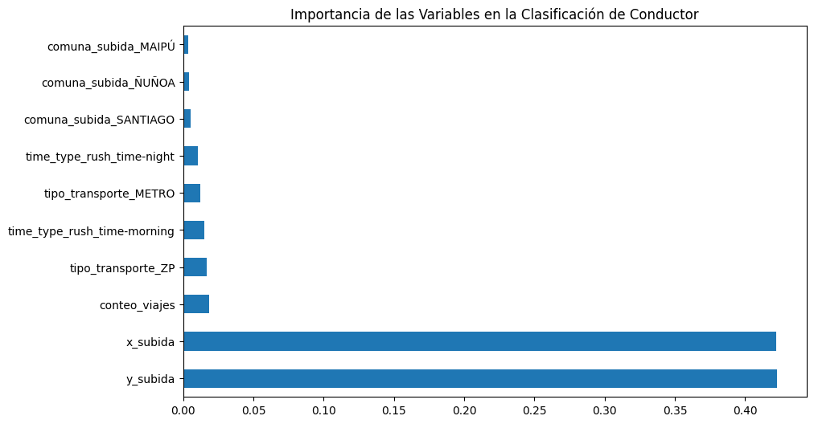

El modelo reveló claramente qué factores son los impulsores del riesgo. Los resultados mostraron que la geografía es el factor dominante:

- _Coordenadas (x_subida, y_subida): Son las variables más importantes. Esto valida que la ubicación exacta del paradero es el factor principal para definir el riesgo._

- _Volumen de Viajes (conteo_viajes): El tráfico en el paradero es el segundo factor más relevante, confirmando que la densidad operacional aumenta la probabilidad de siniestro._

- _Variables Operacionales: Factores como la hora punta (time_type) y el tipo de transporte también contribuyen al riesgo._

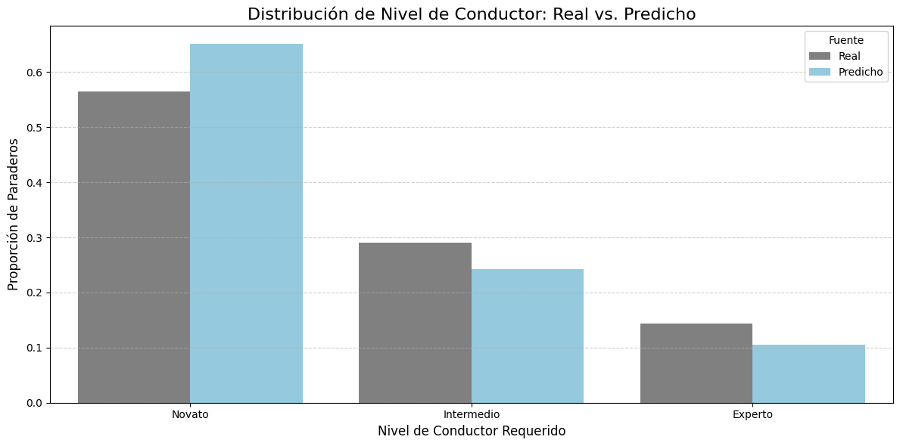  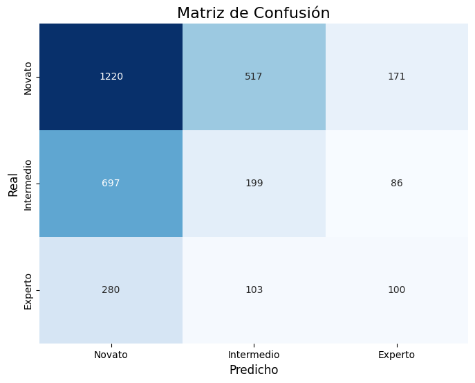

#### 5.3.5 Resultado

Este análisis sienta las bases para optimizar la asignación de recursos humanos y reducir los indicadores de siniestralidad.

El modelo Random Forest demostró ser efectivo para crear fronteras de riesgo basadas en la geografía. Al lograr una buena tasa de predicción (observada en la Matriz de Confusión), aseguramos que la gran mayoría de los paraderos de riesgo crítico ('Experto') sean correctamente identificados, lo que permite una toma de decisiones focalizada:

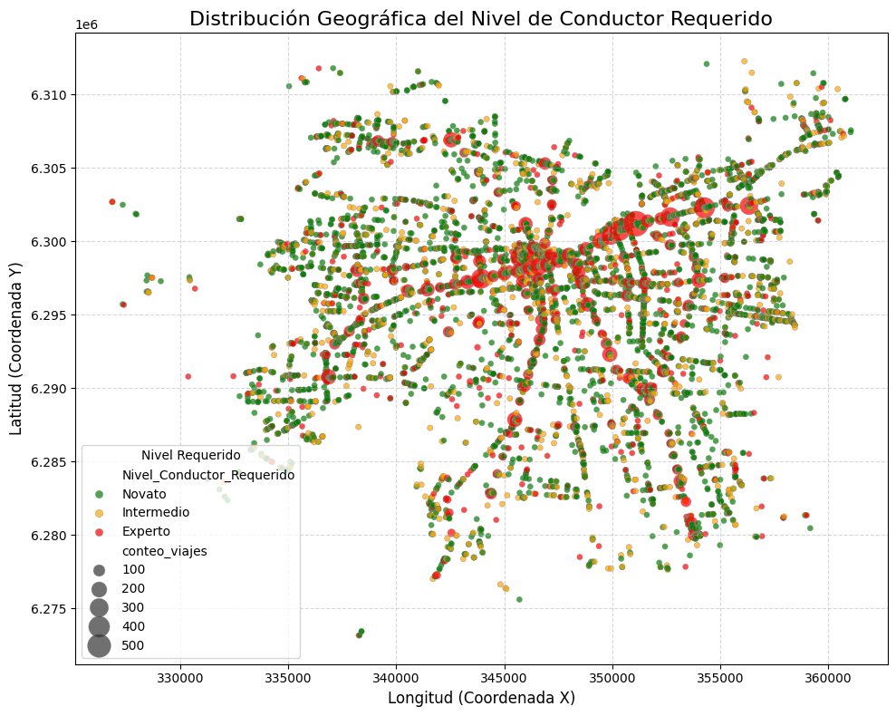 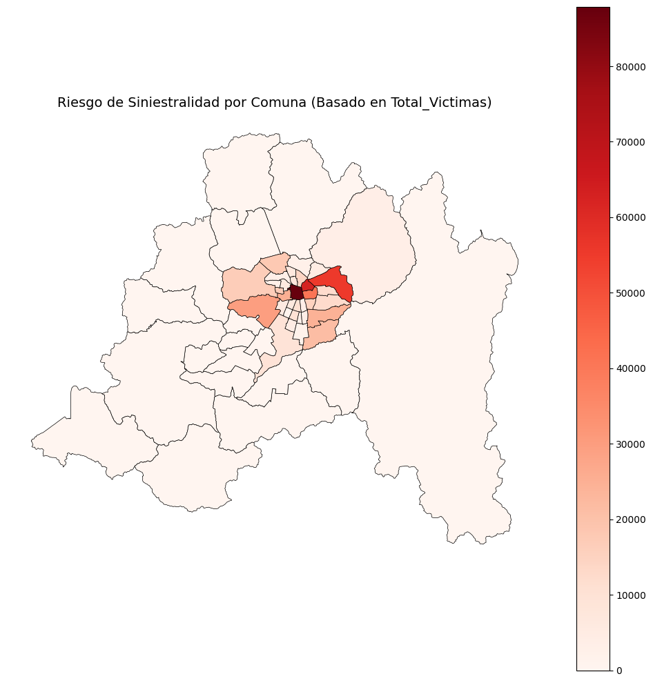

**Decisión: Asignar conductores con mayor experiencia únicamente a los paraderos clasificados como 'Experto' para mejorar la seguridad operacional.**

##### ¿Qué podria salir mal?

Este análisis se basa en los datos historicos de accidentes de trafico, lo que introduce varias limitaciones:

Primero, **existe un sesgo si los datos no incluyen accidentes leves o no reportados**, lo que subestima el riesgo real. Se podria pasar por alto lugares criticos en donde se necesite conductores mas experimentados.

Segundo, el modelo puede crear un **riesgo de "sobre-asignación" si los paraderos clasificados como 'Experto' son cubiertos de manera excesiva**, desviando recursos de zonas 'Intermedio' que también requieren atención.

Tercero, como la geografía (coordenadas) es el factor dominante, **el modelo no toma en cuenta cambios en la infraestructura o la operación (desvíos de ruta, nuevos paraderos, etc.)**, ya que asume que el riesgo en un punto geográfico se mantendrá constante, pudiendo llevar a decisiones subóptimas si el entorno cambia.

Cuarto, Debido a las restricciones de permisos, **la muesta que utilizamos no representa completamente a la situacion real que ocurre diariamente** (viajes, accidentes, registros meteorologicos), reduciendo la fiabilidad de nuetros resultados.
